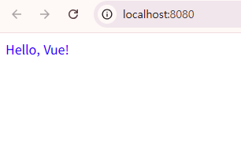
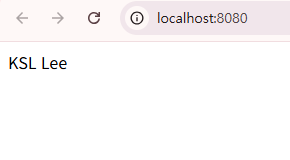
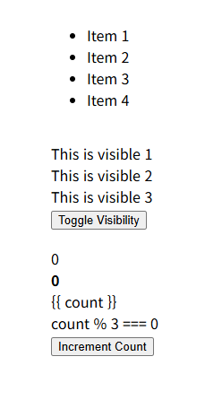
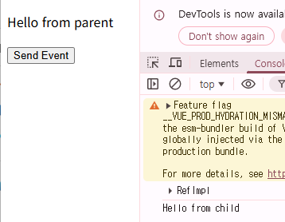
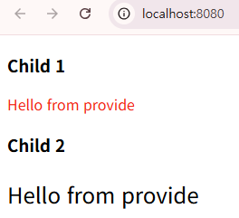
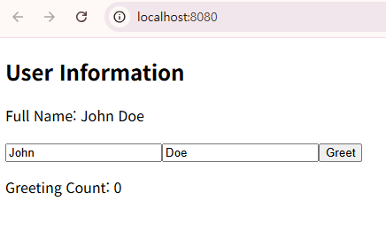
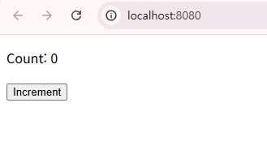
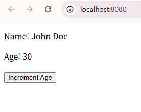
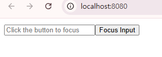

# Vue 2 to Vue 3 마이그레이션 예제

본 문서는 Vue 2의 Options API 기반 코드를 Vue 3의 Composition API(`<script setup>`) 스타일로 변환한 예제 모음입니다. 각 예제는 변환의 목적과 사용된 핵심 API를 기술합니다.

---

## 1. 기본 개념 (Example 1)

* **E-01-instance.vue**: 기본적인 `<script setup>` 변환.
* **E-02-reactive.vue**: Vue 2의 `data` 옵션을 `reactive` API로 대체하여 반응형 상태를 관리.
* **E-03-binding.vue**: `ref`와 `computed`를 사용한 양방향 및 단방향 데이터 바인딩 처리.

## 2. 디렉티브 (Example 2)

* **E-04-directives.vue**: `v-if`, `v-for` 등 주요 디렉티브

## 3. Props & Events (Example 3)

* **ParentComponent.vue**: 부모 컴포넌트가 `ref`로 상태를 정의하고, Props 전달 및 이벤트 수신을 처리하는 예제.
* **ChildComponent.vue**: 자식 컴포넌트가 `defineProps`와 `defineEmits`를 사용하여 데이터를 수신하고 커스텀 이벤트를 발생.

## 4. Provide/Inject (Example 4)

* **ParentComponent.vue**: `provide` API를 통해 하위 컴포넌트에 데이터를 전달하는 부모 컴포넌트.
* **ChildComponent1.vue**: `inject` API를 통해 상위 데이터를 주입받는 자식 컴포넌트 1.
* **ChildComponent2.vue**: 다수의 주입 데이터를 수신하여 내부 상태로 활용하는 자식 컴포넌트 2.

## 5. API 비교 (Example 5)

* **E-07-Options-API.vue**: E-09과 동일

## 6. Ref & Reactive 심화 (Example 6)

* **E-10-ref.vue**: `ref`의 다양한 활용법 및 템플릿 DOM 참조.
* **E-11-reactive.vue**: `reactive` 객체와 `toRefs` 유틸리티를 함께 사용하여 반응형 상태를 관리.
* **E-12-ref-component.vue**: `ref`사용하여 자식 컴포넌트 참조 후 메서드 호출.

### Example 1 - E-01-instance.vue

### Example 1 - E-02-reactive.vue

### Example 1 - E-03-binding.vue

### Example 2 - E-04-directives.vue

### Example 3 - ParentComponent.vue

### Example 4 - ParentComponent.vue

### Example 5 - E-07-Options-API.vue

### Example 6 - E-10-ref.vue

### Example 6 - E-11-reactive.vue

### Example 6 - E-12-ref-component.vue
